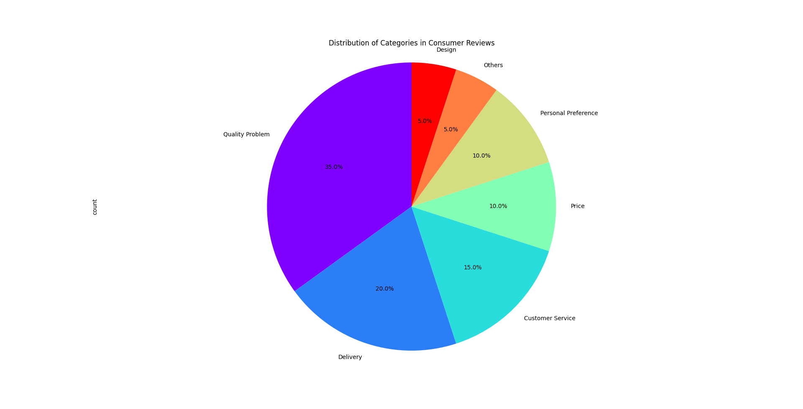

### **README: Consumer Review Analysis System**

This is a cutting-edge consumer review analyzer that leverages the latest advancements in AI technology. By utilizing a powerful large language model, it can extract valuable business insights from a massive volume of consumer reviews. With minimal adjustments, this tool is adaptable to nearly any business scenario. Whether it's improving product defects, analyzing customer feedback, understanding competitor advantages, or even discovering business opportunities through platforms like TikTok comments, this system opens doors to limitless possibilities. Think of it as a key to unlock new realms of business opportunities. All you need is a sufficiently powerful computer, and you can tap into low-cost commercial opportunity discovery—only requiring minimal electricity and time. In the past, such tasks would have demanded massive human resources, time, and capital. 

Please note: This project is a demonstration of my skills and is not licensed for commercial use without my permission. If you wish to use it commercially, you must obtain my consent.

In the example provided, the program reads reviews from a CSV file and sends them to the Gemma2 language model for classification and analysis. The quality of the analysis largely depends on how you adjust the `task_prompt` and `category_reasons`, as well as the quality of your data. `task_prompt` defines the model's instructions and clear guidance significantly enhances the model's ability to respond accurately. `category_reasons` represents the set of categories you want to classify, such as product quality issues, logistics problems, and more. If the model identifies a reason outside the provided `category_reasons`, it will automatically add a new reason to the list. This type of AI-powered analysis was unimaginable just a few years ago and is now a breakthrough technology. 

Since the system is built on the Hugging Face library, you can easily switch to other public language models with minimal changes. However, if your data quality is poor—so poor that even a human would struggle to make sense of the answers—it's recommended to use the latest GPT models, although they can be very costly for large datasets.

Here is a preview of some summarized data analyzed by 2B model: . 
And the 9B model：

For a detailed overview, refer to the `result_data_2Bmodel.csv`  and `result_data_9Bmodel.csv` file in the `data` directory. It’s worth noting that the original `category_reasons` didn’t provide a category for design flaws, but the AI still identified and added it to the summary. This is an exciting result! Imagine the potential commercial value that could be unlocked with the right data and team to outpace your competitors.

In principle, larger models yield better results. However, due to my limited computing power, I can only demonstrate the 2B and 9B versions. 

Due to the complexity of the Hugging Face installation tutorial and the abundance of resources available online, this project will not elaborate on the installation process.
---

### **Contact Information**

**Email**: 402868327@qq.com

---

### **README: 消费者评论分析系统**

这是一个结合现代最新AI科技结晶的消费者评论分析器。它利用强大的大语言模型，从大量的消费者评价中提取有价值的商业洞察。经过少量的调整，该工具可以适用于几乎任何商业场景。无论是改进产品缺陷、分析消费者反馈、了解竞争对手优势，还是通过Tiktok评论发掘商业机会，这个系统都能为你打开无限的商业机会大门。可以说，它是通往新商业世界的钥匙。只需要一台足够强劲的电脑，你就可以进行低成本的商业机会发掘，所需的成本仅仅是少量的电费和一定的时间，过去这一切可能需要大量的人工、时间和资金。

请注意：该项目为技能展示项目，未经我的许可不得商用。如需商用，请先与我取得同意。

在示例中，程序会从CSV文件中读取评论，并将其传送给Gemma2大语言模型进行分类和分析。分析质量取决于你对`task_prompt`和`category_reasons`的调整，以及数据的质量。`task_prompt`是你对模型的提示说明，清晰的表述能够帮助模型更好地理解并给出准确的回答。`category_reasons`则是你需要归纳总结的分类提示，比如产品质量问题、物流问题等。如果模型识别出的原因不在`category_reasons`的范围内，它会自动将新原因添加到列表中。这在过去几年前几乎是无法想象的黑科技。

由于该系统基于Hugging Face库，你可以轻松切换到其他公开的大语言模型，只需要做少量修改。然而，如果你的数据质量非常糟糕，以至于即使是人类也难以理解答案，建议使用最新的GPT模型，尽管对于大规模数据集来说，使用GPT模型的费用非常高。

以下是部分用2B模型进行分析的总结数据的展示: 。
9B数据模型展示
详细的汇总请参考`data`目录下的`result_data_2Bmodel.csv`和`result_data_9Bmodel.csv`文件。值得注意的是，原始的`category_reasons`并没有提供“设计缺陷”的分类，但AI仍然识别并将其添加到后续总结中。这是一个令人兴奋的结果！可以想象，拥有适当的数据和团队支持时，能够创造出多大的商业价值，轻松打败你的竞争对手。

原则上，模型越大，结果越好。由于我的计算能力有限，目前只能演示2B和9B版本。

由于hugging face安装教程繁琐并且网上到处都有，所以本项目不过多赘述安装教程。
---

### **联系方式**

**邮箱**：402868327@qq.com