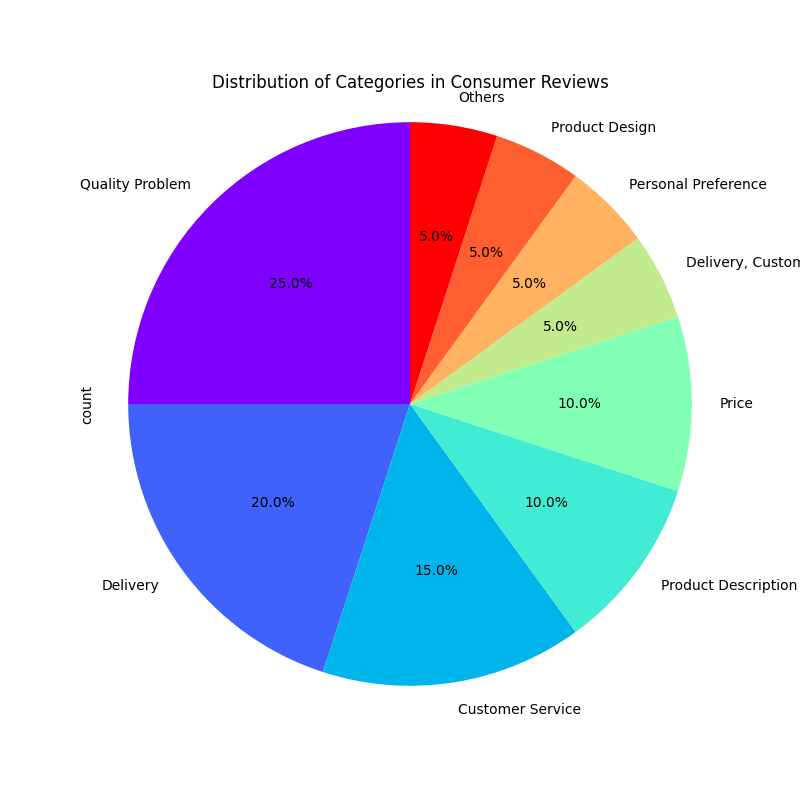
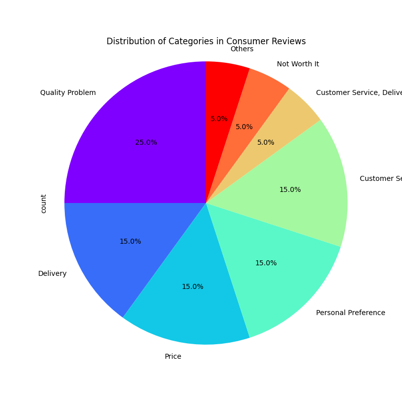

### **README: Consumer Review Analysis System**

This is a cutting-edge consumer review analyzer that leverages the latest advancements in AI technology. By utilizing a powerful large language model, it can extract valuable business insights from a massive volume of consumer reviews. With minimal adjustments, this tool is adaptable to nearly any business scenario.

Whether it's improving product defects, analyzing customer feedback, understanding competitor advantages, or even discovering business opportunities through platforms like TikTok comments, this system opens doors to limitless possibilities. Think of it as a key to unlock new realms of business opportunities. All you need is a sufficiently powerful computer, and you can tap into low-cost commercial opportunity discovery—requiring only minimal electricity and time. In the past, such tasks would have demanded massive human resources, time, and capital.

> **Please Note:**  
This project is a demonstration of my skills and is not licensed for commercial use without my permission. If you wish to use it commercially, you must obtain my consent.

---

### **Example Workflow**

In the example provided, the program reads reviews from a CSV file and sends them to the **Gemma2 language model** for classification and analysis. The quality of the analysis largely depends on:
- How you adjust the `task_prompt` and `category_reasons`.
- The quality of your data.

#### Key Components:
- **`task_prompt`:**  
   Defines the model's instructions. Clear guidance significantly enhances the model's ability to respond accurately.

- **`category_reasons`:**  
   Represents the set of categories you want to classify (e.g., product quality issues, logistics problems, etc.).  
   If the model identifies a reason outside the provided `category_reasons`, it will automatically add a new reason to the list.

This type of AI-powered analysis was unimaginable just a few years ago and is now a breakthrough technology.

---

### **Model Adaptability**

Since the system is built on the **Hugging Face library**, you can easily switch to other public language models with minimal changes. However:
- If your data quality is poor—so poor that even a human would struggle to make sense of it—it is recommended to use the latest GPT models.
- Be mindful that GPT models can be very costly for large datasets.

---

### **Output and Performance**

Below are previews of some summarized data analyzed by different models:

#### **2B Model Output:**

#### **9B Model Output:**

For a detailed overview, refer to the following files in the `data` directory:
- `result_data_2Bmodel.csv`
- `result_data_9Bmodel.csv`

> Noteworthy Result:  
The original `category_reasons` didn’t provide a category for "design flaws," but the AI still identified and added it to the summary. This demonstrates the system's flexibility and intelligence. Imagine the potential commercial value that could be unlocked with the right data and team to outpace your competitors.

#### **Model Size and Performance:**
- In principle, **larger models yield better results.**
- Due to limited computing power, this project only demonstrates the **2B** and **9B** versions.

---

### **Installation Notes**

Due to the complexity of the Hugging Face installation tutorial and the abundance of resources available online, this project does not elaborate on the installation process.

---

### **Contact Information**

**Email:** 402868327@qq.com

---

### **README: 消费者评论分析系统**

这是一个结合现代最新 AI 科技结晶的消费者评论分析器。它利用强大的大语言模型，从大量的消费者评价中提取有价值的商业洞察。经过少量的调整，该工具可以适用于几乎任何商业场景。

无论是改进产品缺陷、分析消费者反馈、了解竞争对手优势，还是通过 TikTok 评论发掘商业机会，这个系统都能为你打开无限的商业机会大门。可以说，它是通往新商业世界的钥匙。只需要一台足够强劲的电脑，你就可以进行低成本的商业机会发掘，所需的成本仅仅是少量的电费和一定的时间——过去这一切可能需要大量的人工、时间和资金。

> **请注意：**  
该项目为技能展示项目，未经我的许可不得商用。如需商用，请先与我取得同意。

---

### **示例工作流程**

在示例中，程序会从 CSV 文件中读取评论，并将其传送给 **Gemma2 大语言模型** 进行分类和分析。分析质量取决于：
- 你对 `task_prompt` 和 `category_reasons` 的调整。
- 数据的质量。

#### 关键组成部分：
- **`task_prompt`：**  
   这是你对模型的提示说明，清晰的表述能够帮助模型更好地理解并给出准确的回答。

- **`category_reasons`：**  
   你需要归纳总结的分类提示，例如产品质量问题、物流问题等。  
   如果模型识别出的原因不在 `category_reasons` 范围内，它会自动将新原因添加到列表中。

这在过去几年几乎是无法想象的黑科技。

---

### **模型适配性**

由于该系统基于 **Hugging Face 库**，你可以轻松切换到其他公开的大语言模型，只需要做少量修改。然而：
- 如果数据质量非常糟糕（即使人类也难以理解），建议使用最新的 GPT 模型，尽管其费用对大规模数据集来说非常高。

---

### **输出和性能**

以下是部分数据的展示：

#### **2B 模型输出:**

#### **9B 模型输出:**

详细的汇总请参考 `data` 目录下的以下文件：
- `result_data_2Bmodel.csv`
- `result_data_9Bmodel.csv`

> 值得注意的结果：  
原始的 `category_reasons` 并没有提供“设计缺陷”的分类，但 AI 仍然识别并将其添加到后续总结中。这是一个令人兴奋的结果！拥有适当的数据和团队支持时，可以轻松打败你的竞争对手。

#### **模型规模与性能：**
- 原则上，**模型越大，结果越好。**
- 由于计算能力有限，目前仅演示了 **2B** 和 **9B** 版本。

---

### **安装说明**

由于 Hugging Face 安装教程繁琐且网上资源丰富，本项目不过多赘述安装过程。

---

### **联系方式**

**邮箱：** 402868327@qq.com